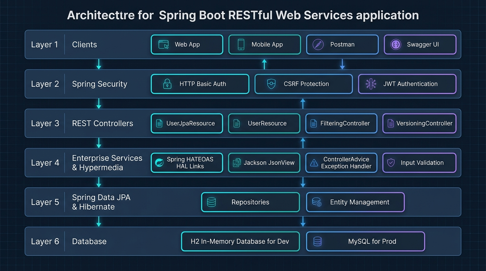

# RESTful Web Services

A comprehensive project for learning and building REST APIs with Spring Boot 4.1.0, Java 26, Spring Data JPA, HATEOAS, and Spring Security.



## Tech Stack

- **Java**: 26 (Oracle JDK 26)
- **Framework**: Spring Boot 4.1.0
- **Web**: Spring Web MVC
- **Security**: Spring Security (HTTP Basic Authentication)
- **Validation**: Jakarta Bean Validation
- **Persistence**: Spring Data JPA & Hibernate
- **Databases**:
  - **H2 In-Memory Database** (Default `dev` profile)
  - **MySQL Database** (`prod` profile)
- **Hypermedia**: Spring HATEOAS
- **API Documentation**: Springdoc OpenAPI / Swagger UI
- **Build Tool**: Apache Maven (Wrapper included)

---

## Features

- **Hello World Endpoints**: Demonstrating plain text, JSON beans, path variables, and internationalization (i18n).
- **Dual Persistence Architecture**:
  - In-memory service (`UserDaoService`) for quick prototyping.
  - Spring Data JPA (`UserRepository`, `PostRepository`) with Hibernate and database seeding.
- **Entity Relationships**: `@OneToMany` and `@ManyToOne` relationship mapping between `User` and `Post`.
- **HATEOAS Hypermedia**: Dynamic link generation (`all-users`) embedded into resource responses.
- **Jackson Filtering**:
  - Static filtering using `@JsonIgnore`.
  - Dynamic filtering using Jackson `@JsonView`.
- **API Versioning**: 4 industry-standard versioning strategies:
  1. URI Path Versioning (`/v1/Person`, `/v2/Person`)
  2. Request Parameter Versioning (`/Person?version=1`)
  3. Custom Request Header Versioning (`x-api-version: 1`)
  4. Media Type / Content Negotiation (`Accept: application/vnd.company.app-v1+json`)
- **Centralized Exception Handling**: `@ControllerAdvice` mapping custom exceptions (`UserNotFoundException`, `PostNotFoundException`, validation failures) to clean, standardized JSON errors.
- **Security & Whitelisting**: HTTP Basic Authentication with CSRF protection disabled for REST operations and frame options enabled for the H2 console.
- **Automated Test Suite**: 20 comprehensive `MockMvc` integration tests verifying all endpoints and security behavior.

---

## API Endpoints

### 1. Hello World & Internationalization
| Method | Endpoint | Description |
| :--- | :--- | :--- |
| `GET` | `/hello-world` | Returns a simple text response |
| `GET` | `/hello-world-bean` | Returns a JSON message bean |
| `GET` | `/hello-world/PathVariable/{name}` | Returns a personalized message with path variable |
| `GET` | `/hello-world-Internationalized` | Returns localized greeting via `Accept-Language` header (`en`, `nl`) |

### 2. In-Memory User Management
| Method | Endpoint | Description |
| :--- | :--- | :--- |
| `GET` | `/users` | Get all in-memory users |
| `GET` | `/users/{id}` | Get one user by ID (with HATEOAS `all-users` link) |
| `POST` | `/users` | Create a new user (with validation) |
| `DELETE` | `/users/{id}` | Delete a user by ID |

### 3. JPA Database-Backed Users & Posts
| Method | Endpoint | Description |
| :--- | :--- | :--- |
| `GET` | `/jpa/users` | Get all users from database |
| `GET` | `/jpa/users/{id}` | Get one user by ID from database |
| `POST` | `/jpa/users` | Create a user in database |
| `DELETE` | `/jpa/users/{id}` | Delete a user from database |
| `GET` | `/jpa/users/{id}/posts` | Get all posts belonging to a user |
| `GET` | `/jpa/users/{id}/posts/{postId}` | Get a specific post for a user |
| `POST` | `/jpa/users/{id}/posts` | Create a new post attached to a user |

### 4. Jackson Filtering
| Method | Endpoint | Description |
| :--- | :--- | :--- |
| `GET` | `/filtering` | Static filtering (`field2` hidden) |
| `GET` | `/filtering-list` | Static filtering on a list of objects |
| `GET` | `/filtering-with-view` | Dynamic filtering with `View.View1` |
| `GET` | `/filtering-list-with-view` | Dynamic filtering with `View.View2` |

### 5. API Versioning
| Strategy | Method | Endpoint / Condition |
| :--- | :--- | :--- |
| **URI Path** | `GET` | `/v1/Person` (Version 1: string name) |
| **URI Path** | `GET` | `/v2/Person` (Version 2: firstName + lastName) |
| **Request Param** | `GET` | `/Person?version=1` |
| **Request Param** | `GET` | `/Person?version=2` |
| **Request Header**| `GET` | `/Person/header` (Header: `x-api-version: 1` or `2`) |
| **Accept Header** | `GET` | `/Person/accept` (Header: `Accept: application/vnd.company.app-v1+json`) |

---

## Security & Authentication

API endpoints are secured using HTTP Basic Authentication:
- **Username**: `amit`
- **Password**: `1234`

Publicly accessible endpoints (no credentials required):
- Swagger UI: `/swagger-ui/**`, `/swagger-ui.html`
- OpenAPI Specification: `/v3/api-docs/**`
- H2 Console: `/h2-console/**`

---

## Profiles & Database Configuration

The application supports profile-based database configuration:

### 1. Development Profile (`dev`) - Default
Uses in-memory H2 database. Data is pre-seeded on startup from `data.sql`.
- **H2 Console URL**: `http://localhost:8080/h2-console`
- **JDBC URL**: `jdbc:h2:mem:testdb`
- **Username**: `sa`
- **Password**: *(empty)*

### 2. Production Profile (`prod`)
Connects to external MySQL database:
- **JDBC URL**: `jdbc:mysql://localhost:3307/social-media-database`
- **Username**: `social-media-user`

To run with the MySQL profile:
```powershell
.\mvnw.cmd spring-boot:run -Dspring-boot.run.profiles=prod
```

---

## Validation Rules

- `name`: Must contain between 2 and 20 characters (`@Size(min=2, max=20)`).
- `birthDate`: Must be a current or past date (`@PastOrPresent`).
- `description` (Post): Must have at least 10 characters (`@Size(min=10)`).

### Example JSON for Creating a User (`POST /jpa/users` or `POST /users`)
```json
{
  "name": "Amit Singh",
  "birthDate": "2000-01-01"
}
```

### Example JSON for Creating a Post (`POST /jpa/users/{id}/posts`)
```json
{
  "description": "Learning Spring Boot and Cloud Computing"
}
```

---

## Running the Application Locally

### 1. Run with Maven
On Windows PowerShell:
```powershell
.\mvnw.cmd spring-boot:run
```

On Linux / macOS:
```bash
./mvnw spring-boot:run
```

The application starts on port `8080`: `http://localhost:8080`.

### 2. Run Automated Tests
Execute the full test suite (20 tests covering controllers, security, validation, filtering, and JPA):
```powershell
.\mvnw.cmd test
```

### 3. Access Swagger UI Documentation
Open in your browser:
```text
http://localhost:8080/swagger-ui.html
```
OpenAPI JSON format:
```text
http://localhost:8080/v3/api-docs
```
